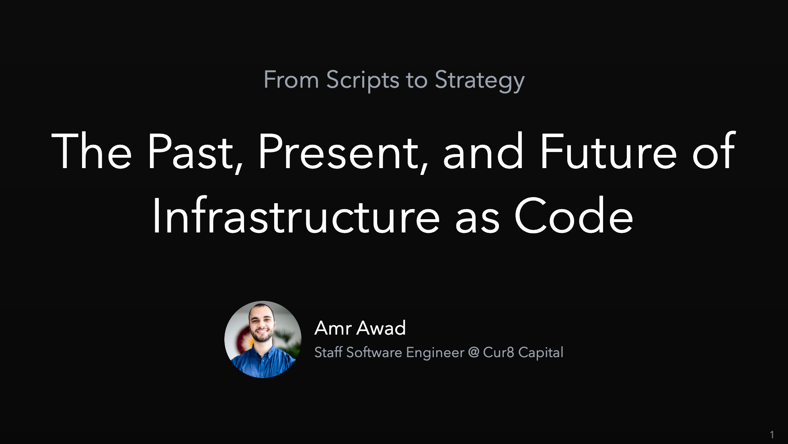

# From Scripts to Strategy: The Past, Present, and Future of Infrastructure as Code

This repo contains the slides originally presented in JobStack 24, one of the biggest tech conferences in MENA, with over 7500 attendees from 11+ countries.

More details on the talk can be found in [this blog post](https://amrawad.com/talks/from-scripts-to-strategy-the-past-present-and-future-of-infrastructure-as-code).

The slides were built with [Slidev](https://sli.dev).